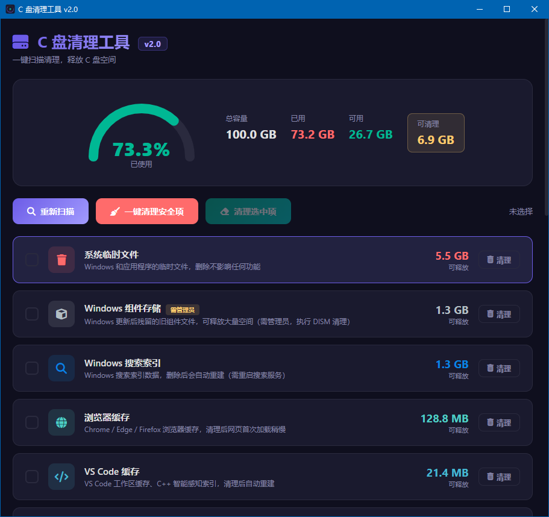

# 🧹 C盘清理工具 v2.0

一个简洁、现代、无广告的 Windows C 盘清理工具。

> **单文件运行 | 无需安装 | 开源免费**

---

## 截图

*暗紫色主题界面，简洁直观*

---

## 核心功能

### 🔍 一键扫描
自动识别并分类以下垃圾文件：

- 系统临时文件（Windows/Temp、Local Temp）
- 浏览器缓存（Chrome、Edge、Firefox）
- 聊天工具缓存（微信、QQ）
- Windows 更新残留文件
- 系统缩略图缓存
- 系统休眠文件（hiberfil.sys）
- 回收站内容
- 系统日志和崩溃转储文件
- 开发工具缓存（VS Code、JetBrains）
- 下载文件夹和系统补丁缓存

### 🎯 智能安全策略
- **仅勾选可安全清理的项目**：高危系统目录默认不勾选
- **实时空间显示**：扫描后显示每个项目的可释放空间
- **磁盘仪表盘**：可视化 C 盘总容量、已用空间、可释放空间

### 🚀 一键清理
- 支持单个项目清理
- 支持批量勾选清理
- 支持一键全清（仅清理已勾选的安全项）

---

## 为什么做这个工具？

市面上的 C 盘清理工具，要么广告满天飞，要么界面停留在 2005 年。

这个工具做了三件事：

1. **好看** — 暗紫色现代主题，拒绝丑陋界面
2. **干净** — 没有任何广告、弹窗、推广
3. **不瞎删** — 危险目录默认不勾选，误删风险极低

---

## 下载

| 版本 | 下载 | 说明 |
|------|------|------|
| v2.0 | [C盘清理工具v2.0.exe](https://github.com/CRenChenhao/cdisk-cleaner/releases/latest) | 最新版本，支持占用分析 |

- **系统要求**：Windows 10 / 11（64 位）
- **运行方式**：双击运行，自动请求管理员权限
- **无需安装**：单文件，不写注册表

---

## 技术栈

- **前端**：HTML5 / CSS3 / JavaScript
- **后端**：Python 3 + Flask
- **GUI**：pywebview（系统原生浏览器引擎）
- **打包**：PyInstaller（单文件可执行程序）

---

## 开发背景

本项目初衷是做一个**给自己用**的 C 盘清理工具：
- 不臃肿，打开就能用
- 不瞎删，看清每个操作
- 不打扰，没有弹窗和广告

如果你也觉得好用，欢迎点个 Star 或分享给需要的朋友。

---

## 开源协议

[MIT License](LICENSE)

Copyright (c) 2026
